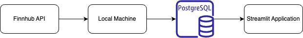
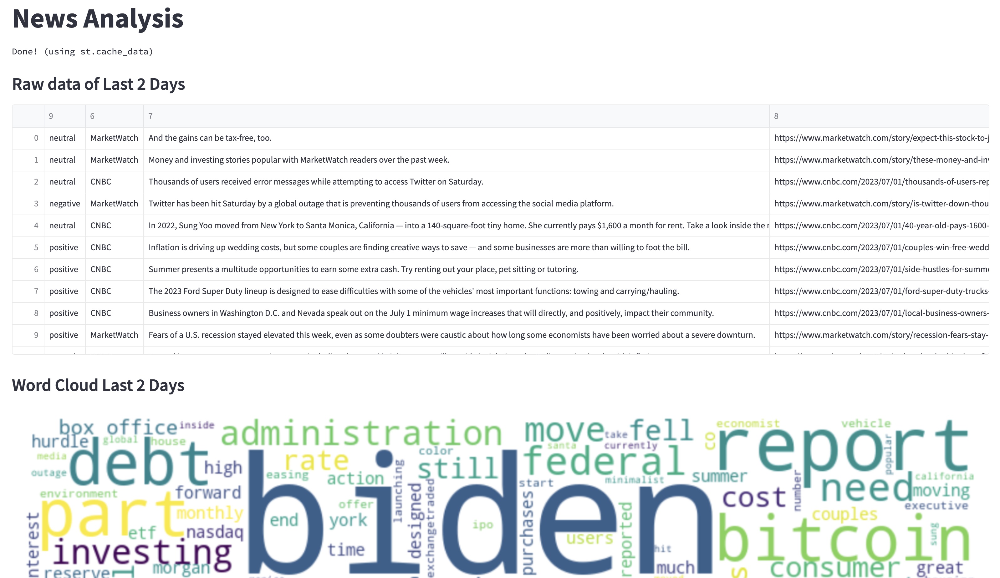

# stock_news_analysis

The stock news analysis script periodically fetches data from the FinHub API every 16 minutes. The retrieved data is then processed to ensure proper formatting and sentiments are applied to the news summaries. Finally, the transformed data is pushed into a Postgres SQL database.

To present the results of the word cloud and news sentiments, the script utilizes the Streamlit framework.

Architecture Diagram

Dashboard

### Postgres Server
brew services start postgresql@14
brew services stop postgresql@14
brew services list

### List all listening ports
lsof -i -P -n | grep LISTEN